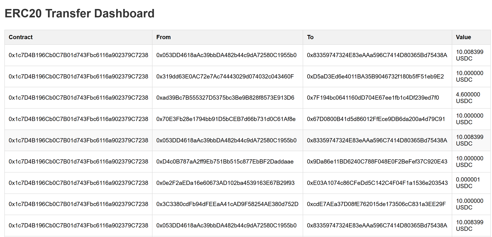

## 这是eth相关的学习内容day2

编写一个实时查看某些合约的实时转账信息的界面

### Part1-准备

第一：
在eth测试网络sepolia.infura.io，不仅提供了RPC能力，也提供了ws能力

wss://sepolia.infura.io/ws/v3/779e8a98dfb1417a9ad6002e4d1faa91类似这样的就是ws推送，最后的key要换成自己的key

第二：就是查找一些主流代币的合约地址

0x1c7D4B196Cb0C7B01d743Fbc6116a902379C7238,0x6B4F879c672aE86546dA2e9Bb79f10d6404E4fE2
这些是USDC和USDT的合约地址，交易比较频繁

第三：安装好本地的redis服务

### Part2-配置.env

配置.env
```
# Ethereum RPC 连接 (WebSocket 推荐)
RPC_URL=wss://sepolia.infura.io/ws/v3/779e8a98dfb1417a9ad6002e4d1faa91

# 监听的 ERC20 合约地址，可逗号分隔多个
ERC20_CONTRACTS=0x1c7D4B196Cb0C7B01d743Fbc6116a902379C7238,0x6B4F879c672aE86546dA2e9Bb79f10d6404E4fE2

# Redis 地址
REDIS_ADDR=localhost:6379

# 可选: Redis 密码
REDIS_PASSWORD=

# 可选: Web 服务端口（默认8080）
PORT=8080

```

### Part3-编写程序
第一：获取依赖
```
	"github.com/ethereum/go-ethereum"
	"github.com/ethereum/go-ethereum/accounts/abi"
	"github.com/ethereum/go-ethereum/common"
	"github.com/ethereum/go-ethereum/core/types"
	"github.com/ethereum/go-ethereum/ethclient"
	"github.com/gin-gonic/gin"
	"github.com/go-redis/redis/v8"
	"github.com/gorilla/websocket"
	"github.com/joho/godotenv"
```

第二：编写[./main.go](main.go)

内容比较多，可以直接看[./main.go](main.go)

主要是实现ws/http等

第三：编写[./static/index.html](static/index.html)
```
<!DOCTYPE html>
<html lang="en">
<head>
  <meta charset="UTF-8">
  <title>ERC20 Transfer Dashboard</title>
  <style>
    body { font-family: Arial, sans-serif; margin: 20px; }
    h1 { color: #333; }
    table { width: 100%; border-collapse: collapse; margin-top: 20px; }
    th, td { border: 1px solid #ddd; padding: 8px; text-align: left; }
    th { background-color: #f2f2f2; }
    tr:hover { background-color: #f9f9f9; }
  </style>
</head>
<body>
  <h1>ERC20 Transfer Dashboard</h1>
  <table id="transferTable">
    <thead>
      <tr>
        <th>Contract</th>
        <th>From</th>
        <th>To</th>
        <th>Value</th>
      </tr>
    </thead>
    <tbody></tbody>
  </table>

  <script>
    window.onload = function() {
      const ws = new WebSocket("ws://localhost:8080/ws");
      const tbody = document.querySelector("#transferTable tbody");

      ws.onopen = () => console.log("WebSocket 已连接");
      ws.onclose = () => console.log("WebSocket 已断开");

      ws.onmessage = function(event) {
          const msg = event.data;
          const regex = /(0x[0-9a-fA-F]+) \| From: (0x[0-9a-fA-F]+) To: (0x[0-9a-fA-F]+) Value: ([\d.]+) (\w+)/;
          const match = msg.match(regex);
          if (!match) return;

          const tr = document.createElement("tr");
          tr.innerHTML = `
              <td>${match[1]}</td>
              <td>${match[2]}</td>
              <td>${match[3]}</td>
              <td>${match[4]} ${match[5]}</td>
          `;
          tbody.prepend(tr);

          while (tbody.children.length > 20) {
              tbody.removeChild(tbody.lastChild);
          }
      };
    }
  </script>
</body>
</html>
```

### Part4-启动运行

输入
```
go run .\main.go
```

输出
```
[GIN-debug] [WARNING] Creating an Engine instance with the Logger and Recovery middleware already attached.

[GIN-debug] [WARNING] Running in "debug" mode. Switch to "release" mode in production.
 - using env:   export GIN_MODE=release
 - using code:  gin.SetMode(gin.ReleaseMode)

[GIN-debug] GET    /ws                       --> main.main.func1 (3 handlers)
[GIN-debug] GET    /static/*filepath         --> github.com/gin-gonic/gin.(*RouterGroup).createStaticHandler.func1 (3 handlers)
[GIN-debug] HEAD   /static/*filepath         --> github.com/gin-gonic/gin.(*RouterGroup).createStaticHandler.func1 (3 handlers)
2025/10/25 20:18:16 🚀 Web3 Dashboard running on http://localhost:8080/static/index.html
[GIN-debug] [WARNING] You trusted all proxies, this is NOT safe. We recommend you to set a value.
Please check https://github.com/gin-gonic/gin/blob/master/docs/doc.md#dont-trust-all-proxies for details.
[GIN-debug] Listening and serving HTTP on :8080
```

表示运行成功了

### Part5-运行效果
进入浏览器，输入`http://localhost:8080/static/`

等待一段时间，出现如下信息，说明运行正常



### 总结
1. 代币合约的交易是有ws推荐的
2. 代币合约的交易是公开可查的
3. 以太坊中代币合约是可以发行代币的