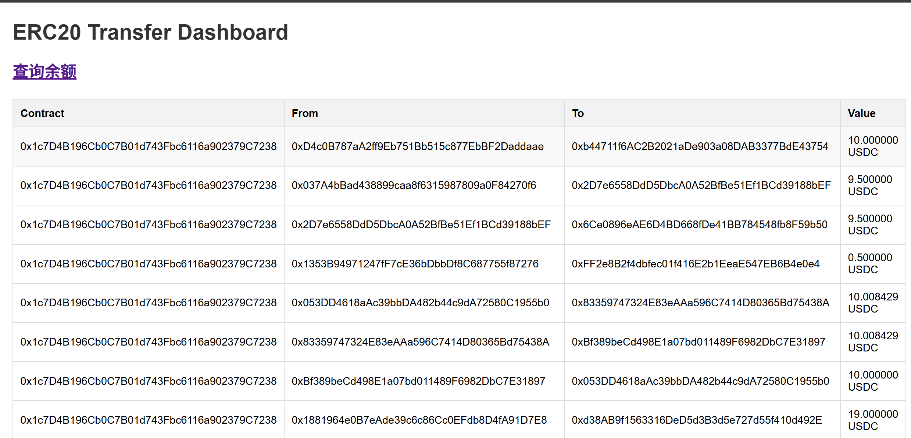
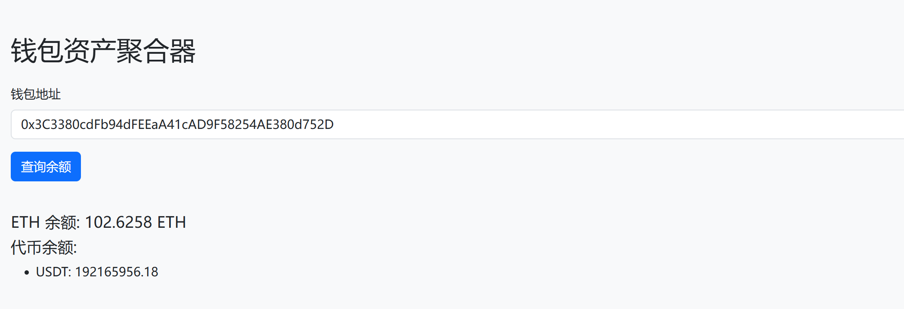

# Web3 Wallet Tracker

## 🧭 Overview | 项目概述
Web3 Wallet Tracker 是一个基于 Go 语言编写的轻量级钱包追踪系统，用于监听区块链上 ERC20 转账事件，并通过 WebSocket 实时推送到前端页面。  
该系统同时支持查询指定钱包地址的 ETH 余额与代币余额。

---

## 📂 Project Structure | 项目结构
```
web3_wallet_tracker/
├── main.go                # 程序入口
├── go.mod / go.sum        # Go 依赖管理文件
├── .env                   # 环境配置文件 (RPC URL, Redis 配置等)
│
├── api/                   # API 层，定义 HTTP/WebSocket 接口
│   ├── api_router.go
│   ├── handler.go
│   ├── ws_hander.go
│
├── info/                  # 常量与类型定义
│   ├── constants.go
│   ├── types.go
│
├── infra/                 # 基础设施层，封装底层依赖
│   ├── config.go          # 配置加载
│   ├── eth_client.go      # 以太坊 RPC 客户端封装
│   ├── redis_client.go    # Redis 客户端封装
│
├── service/               # 业务逻辑层
│   ├── balanace_service.go  # 钱包余额查询逻辑
│
├── task/                  # 任务与事件监听
│   ├── ws_listener.go     # 区块链事件监听 (ERC20 Transfer)
│
└── static/                # 前端静态文件
    ├── index.html         # 实时监听展示页面
    ├── balance.html       # 钱包余额查询页面
```

---

## ⚙️ Installation & Run | 安装与运行

### 1️⃣ 环境依赖
- Go 1.22+
- Redis
- 以太坊兼容节点（如 Infura, Alchemy 或本地 Geth）

### 2️⃣ 配置 `.env` 文件
```env
ETH_RPC_URL=https://mainnet.infura.io/v3/your_api_key
REDIS_ADDR=127.0.0.1:6379
REDIS_PASSWORD=
WS_PORT=8080
```

### 3️⃣ 启动服务
```bash
go run main.go
```

### 4️⃣ 访问前端
打开浏览器访问：  
```
http://localhost:8080/static/index.html      # 实时监听页面
http://localhost:8080/static/balance.html    # 查询钱包余额页面
```

---

## 🧠 Features | 功能介绍
| 功能 | 描述 |
|------|------|
| 💬 WebSocket 实时推送 | 实时推送 ERC20 Transfer 事件 |
| 💰 余额查询 | 查询钱包 ETH 及代币余额 |
| 💾 Redis 缓存 | 提高接口查询性能与数据持久化 |
| 🧩 模块化架构 | 基于分层设计，清晰易维护 |

---

## 📸 Preview | 页面预览

### 🎛 Transfer Dashboard


### 💼 Wallet Balance


---

## 🧑‍💻 Author | 作者
- **Jason**
- Backend Engineer
- 技术栈：Go / PHP / Redis / TiDB / EKS / Hyperf

---

## 🕓 Last Update | 更新时间
2025-10-27 07:09:59
