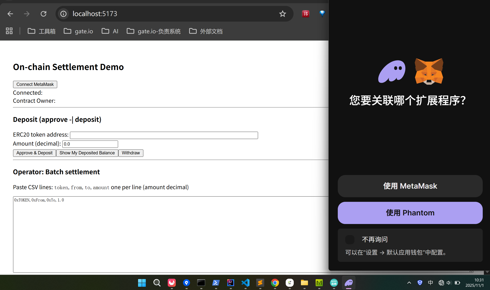
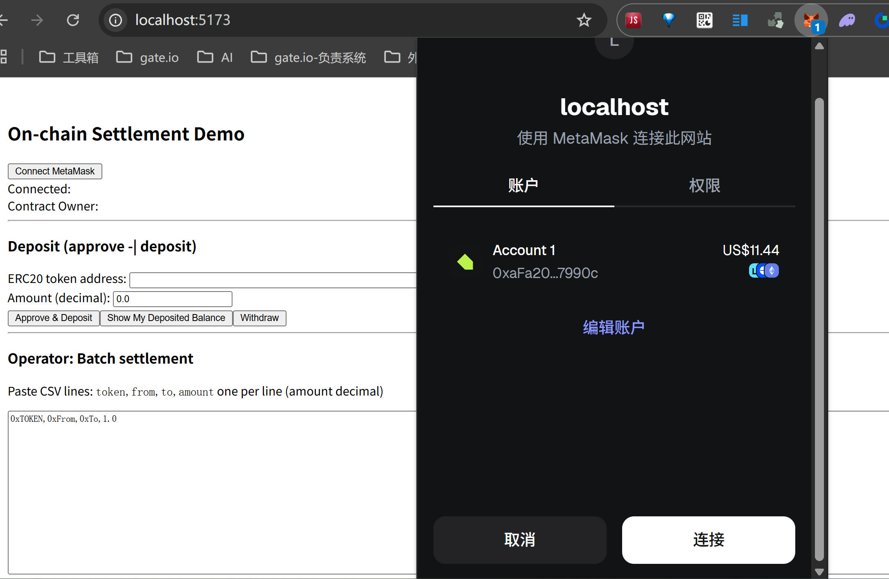
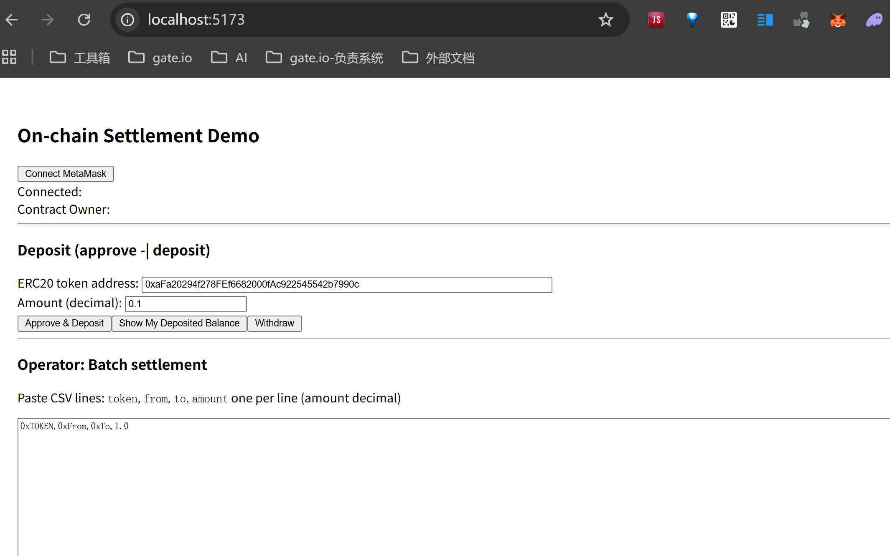

# “链上最终结算”（React + Vite / TypeScript） / On chain final settlement

## 1️⃣ 项目概述 / Project Overview

本项目是一个基于 Ethereum/ERC-210.IERC20 链上结算项目演示，支持：

- 部署 Settlement 合约到测试网（Sepolia/Goerli）

This project is an Ethereum ERC-721 NFT project, supporting:


---

----
## 2️⃣ 环境配置 / Environment Setup

1. 安装 Node.js 和 npm
2. 安装依赖：

```bash
npm install ethers dotenv ts-node typescript @openzeppelin/contracts node-fetch
```

## 3️⃣ 创建 .env 文件
填写 RPC URL 和钱包私钥：
```env
SEPOLIA_RPC_URL=https://sepolia.infura.io/v3/YOUR_PROJECT_ID
SEPOLIA_PRIVATE_KEY=0x你的钱包私钥
```
----
## 4️⃣ Settle合约编写&编译 / Settle Contract Code and Compile
合约 OnchainSettle.sol 使用ERC210.IERC20 和 Ownable：
```js
// SPDX-License-Identifier: MIT
pragma solidity ^0.8.20;

import "@openzeppelin/contracts/token/ERC20/IERC20.sol";
import "@openzeppelin/contracts/access/Ownable.sol";

/// @title OnchainSettle
/// @notice Users deposit ERC20 tokens to this contract. Operator (owner) can submit a batch of settlement transfers.
///         The contract will atomically execute all transfers from deposited balances to recipients.
contract OnchainSettle is Ownable {
    // token => user => balance (deposited into contract)
    mapping(address => mapping(address => uint256)) public deposits;

    event Deposited(address indexed token, address indexed user, uint256 amount);
    event Withdrawn(address indexed token, address indexed user, uint256 amount);
    event BatchSettled(address indexed operator, uint256 numTransfers);

    constructor() Ownable(msg.sender) {}

    /// @notice Deposit ERC20 tokens to the contract. User must approve this contract beforehand.
    function deposit(address token, uint256 amount) external {
        require(amount > 0, "amount=0");
        // transferFrom user -> this
        bool ok = IERC20(token).transferFrom(msg.sender, address(this), amount);
        require(ok, "transferFrom failed");
        deposits[token][msg.sender] += amount;
        emit Deposited(token, msg.sender, amount);
    }

    /// @notice Withdraw your deposited tokens (only available if you have balance)
    function withdraw(address token, uint256 amount) external {
        require(amount > 0, "amount=0");
        uint256 bal = deposits[token][msg.sender];
        require(bal >= amount, "insufficient deposited balance");
        deposits[token][msg.sender] = bal - amount;
        bool ok = IERC20(token).transfer(msg.sender, amount);
        require(ok, "transfer failed");
        emit Withdrawn(token, msg.sender, amount);
    }

    /// @notice Batch settlement executed by owner/operator.
    /// @param tokens array of ERC20 token addresses (len = N)
    /// @param froms array of payer addresses (len = N)
    /// @param tos array of recipient addresses (len = N)
    /// @param amounts array of amounts (len = N)
    ///
    /// Requirements:
    ///   - All arrays must be same length
    ///   - For each i, deposits[tokens[i]][froms[i]] >= amounts[i]
    /// The function will deduct deposits and transfer tokens from contract -> recipient for each instruction.
    function settleBatch(
        address[] calldata tokens,
        address[] calldata froms,
        address[] calldata tos,
        uint256[] calldata amounts
    ) external onlyOwner {
        uint256 n = tokens.length;
        require(n > 0, "empty batch");
        require(froms.length == n && tos.length == n && amounts.length == n, "length mismatch");

        // First pass: validate balances (to fail early if any insufficient)
        for (uint256 i = 0; i < n; ++i) {
            require(deposits[tokens[i]][froms[i]] >= amounts[i], "insufficient deposited balance for a transfer");
        }

        // Second pass: apply transfers
        for (uint256 i = 0; i < n; ++i) {
            address tok = tokens[i];
            address payer = froms[i];
            address recipient = tos[i];
            uint256 amt = amounts[i];

            // deduct internal balance
            deposits[tok][payer] -= amt;

            // transfer from contract to recipient
            bool ok = IERC20(tok).transfer(recipient, amt);
            require(ok, "erc20 transfer failed in batch");
        }

        emit BatchSettled(msg.sender, n);
    }

    // View helper: get deposited balance
    function depositedBalance(address token, address user) external view returns (uint256) {
        return deposits[token][user];
    }
}

```

合约编译
```bash
# npx hardhat compile
Nothing to compile
Nothing to compile

```
----
5️⃣ Settle合约部署编写&部署 / Deploy Settle Contract Code And Deploy

scripts下编写delpoy.ts

```js
import { ethers } from "ethers";
import fs from "fs";
import path from "path";
import 'dotenv/config';

const { SEPOLIA_PRIVATE_KEY, SEPOLIA_RPC_URL } = process.env;

async function main() {
    // provider 和钱包
    const provider = new ethers.JsonRpcProvider(SEPOLIA_RPC_URL);
    const wallet = new ethers.Wallet(SEPOLIA_PRIVATE_KEY, provider);

    console.log("Deploying with account:", wallet.address);

    // 读取编译好的合约 JSON（ABI + bytecode）
    const artifactPath = path.resolve("artifacts/contracts/OnchainSettle.sol/OnchainSettle.json");
    const artifact = JSON.parse(fs.readFileSync(artifactPath, "utf8"));

    const factory = new ethers.ContractFactory(artifact.abi, artifact.bytecode, wallet);

    const onchainSettle = await factory.deploy();

    await onchainSettle.waitForDeployment();  // ethers v6

    console.log("OnchainSettle deployed at:", onchainSettle.target);
}

main().catch((error) => {
    console.error(error);
    process.exit(1);
});


```
NFT合约部署
```bash
# npx hardhat run scripts/deploy.ts --network sepolia
Nothing to compile
Nothing to compile

Deploying with account: 0xaFa20294f278FEf6682000fAc922545542b7990c
OnchainSettle deployed at: 0x394A2F8504e740a699E416c2a27307591eCfB979

```
----
## 6️⃣ 前端（React）演示 / frontend show

前端步骤
1. 连接 MetaMask
2. 显示已连接地址
3. 对指定 ERC-20（示例：任意 token 地址）执行 approve -> deposit
4. 展示 deposited balance（合约内）
5. 作为 operator（owner）可以在文本框中输入批量结算 CSV 并提交 settleBatch，并打印每笔交易哈希 & 成功信息
6. 普通用户可 withdraw

启动前端
```bash
frontend# npm run dev

> onchain-settlement-demo@0.0.0 dev
> vite


  VITE v5.4.21  ready in 480 ms

  ➜  Local:   http://localhost:5173/
  ➜  Network: use --host to expose
  ➜  press h + enter to show help
```
浏览器访问`http://localhost:5173/`


链接钱包


操作转账/结算等


## 7️⃣ 注意事项 / Notes
1. 注意MetaMusk的网络选择测试网络sepolia

----

## 8️⃣ 参考 / References

[OpenZeppelin ERC210 Documentation](https://docs.openzeppelin.com/contracts/4.x/erc210)

[Ethers.js Documentation](https://docs.ethers.org/v6/)
 


